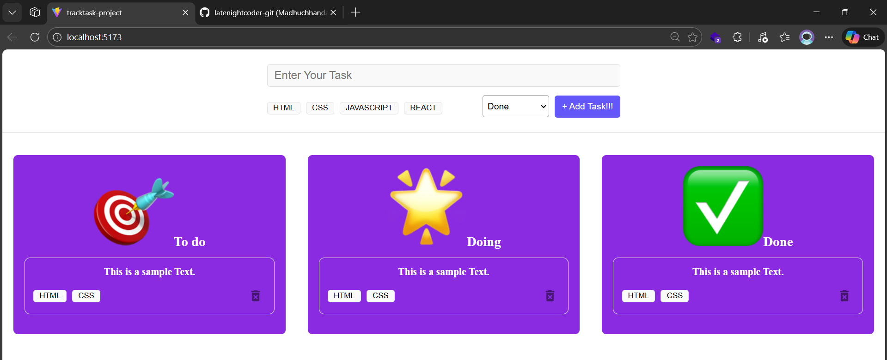

# TRACKTASK-PROJECT
A simple and visually rich task‑tracking application built with **React + Vite**. The project allows users to add tasks, categorize them with tags, and organize them into three workflow stages:

- **To Do**
- **Doing**
- **Done**

Each category features a custom animated icon, expressive colors, and styled task cards to give users an engaging experience.

---

## 🚀 Features
- Add tasks with title, category, and tags
- Categorize tasks into To Do / Doing / Done
- Visual task cards with icons and tag badges
- Smooth UI built with custom CSS
- Delete tasks easily with a clickable delete icon

---

## 📂 Project Structure
```
TRACKTASK-PROJECT/
│
├── images/
│   └── Output.png
│
├── public/
│
├── src/
│   ├── assets/
│   │   ├── check-mark-button.png
│   │   ├── delete.png
│   │   ├── direct-hit.png
│   │   ├── fire.png
│   │   ├── glowing-star.png
│   │   └── react.svg
│   │
│   ├── components/
│   │   ├── Tag.css
│   │   ├── Tag.jsx
│   │   ├── TaskCard.css
│   │   ├── TaskCard.jsx
│   │   ├── TaskColumn.css
│   │   ├── TaskColumn.jsx
│   │   ├── TaskForm.css
│   │   ├── TaskForm.jsx
│   │   └── TaskFormOld.jsx
│   │
│   ├── App.css
│   ├── App.jsx
│   ├── index.css
│   └── main.jsx
│
└── README.md
```


---

## 🖼️ Output Preview
Below is the UI preview of the application.

### **Application UI Screenshot**


---

## 🛠️ Tech Stack
- **React**
- **Vite**
- **JavaScript (ES6+)**
- **CSS3**

---

## 📦 Installation & Setup
Follow the steps below to run the project locally:

```bash
git clone https://github.com/latenightcoder-git/TRACKTASK-PROJECT.git
cd TRACKTASK-PROJECT
npm install
npm run dev
```

Your project will now run on:
```
http://localhost:5173/
```

---


